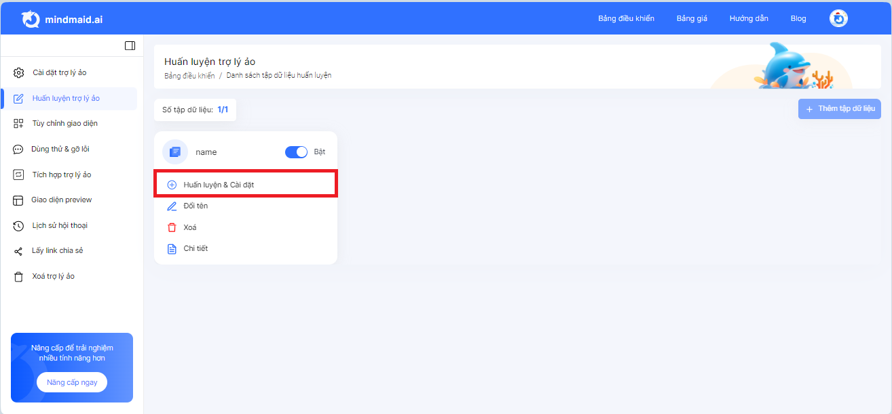

# 2. HDSD Mindmaid - Chuẩn bị dữ liệu & huấn luyện Trợ lý ảo

Mindmaid hiện tại hỗ trợ huấn luyện bằng 3 kiểu dữ liệu, bao gồm:&#x20;

<table><thead><tr><th width="218">Kiểu dữ liệu</th><th>Mô tả</th></tr></thead><tbody><tr><td>Văn bản</td><td>Kiểu dữ liệu <strong>Văn bản</strong> phù hợp nếu bạn chưa có các file dữ liệu, bạn nhập đoạn dữ liệu (đoạn văn giới thiệu công ty, đoạn văn giới thiệu sản phẩm, đoạn văn hướng dẫn sử dụng, ...) hoặc các câu hỏi đáp FAQ trực tiếp vào nền tảng Mindmaid.  Vui lòng xem chi tiết hướng dẫn huấn luyện dữ liệu bằng <strong>Văn bản</strong> tại <a data-mention href="2.-hdsd-mindmaid-chua-n-bi-du-lie-u-hua-n-luye-n-tro-ly-a-o.md#1.-van-ban">#1.-van-ban</a>.</td></tr><tr><td>Tài liệu</td><td>Kiểu dữ liệu tài liệu phù hợp nếu bạn có sẵn các file dữ liệu dạng doc, pdf cần huấn luyện cho Chatbot AI. Vui lòng xem chi tiết hướng dẫn huấn luyện dữ liệu bằng <strong>Tài liệu</strong> tại <a data-mention href="2.-hdsd-mindmaid-chua-n-bi-du-lie-u-hua-n-luye-n-tro-ly-a-o.md#2.-tai-lieu">#2.-tai-lieu</a>.</td></tr><tr><td>Tài liệu mẫu</td><td>Kiểu dữ liệu này phù hợp nếu bạn cần chatbot trả lời có độ chính xác cao. Bạn cần chuẩn bị dữ liệu theo mẫu của chúng tôi. Vui lòng xem chi tiết hướng dẫn huấn luyện dữ liệu bằng <strong>Tài liệu mẫu</strong> tại <a data-mention href="2.-hdsd-mindmaid-chua-n-bi-du-lie-u-hua-n-luye-n-tro-ly-a-o.md#3.-tai-lieu-mau">#3.-tai-lieu-mau</a>.</td></tr></tbody></table>

<figure><figcaption></figcaption></figure>

<figure><figcaption></figcaption></figure>

## 1. Văn bản

Với Văn bản, bạn có thể điền 2 loại là:  Dữ liệu văn bản và Dữ liệu hỏi đáp

* **Dữ liệu văn bản:**&#x20;
  * Là đoạn văn bản giới thiệu công ty, giới thiệu sản phẩm, hướng dẫn sử dụng &#x20;
  * Ví dụ đây là đoạn văn bản: Mindmaid là nền tảng phát triển Trợ lý ảo AI. Mindmaid giúp doanh nghiệp tạo ra Trợ lý ảo thế hệ mới với cá tính riêng biệt và trải nghiệm hỏi-đáp có cảm xúc như người thật nhờ công nghệ ChatGPT. Từ đó mang đến phương thức mới để bán hàng, chăm sóc khách hàng, tuyển dụng, tư vấn, đào tạo...và khai thác các mô hình kinh doanh mới trong kỉ nguyên AI
* **Dữ liệu hỏi đáp**
  * Là câu hỏi và câu trả lời dạng FAQ&#x20;
  * Ví dụ đây là Dữ liệu hỏi đáp
    * Câu hỏi: Mindmaid là gì?
    * Câu trả lời: Nền tảng trợ lý ảo Mindmaid là nền tảng cho phép các cá nhân, doanh nghiệp, tổ chức nhanh chóng tạo ra các trợ lý ảo thế hệ mới và khai thác công nghệ trợ lý ảo để cải tiến quy trình vận hành, sáng tạo mô hình kinh doanh mới.

### 1.1. Hướng dẫn chuẩn bị Văn bản/Dữ liệu văn bản

* Chọn Tab **Văn bản**, tick ô **Dữ liệu văn bản**
* Nhập đoạn văn bản vào ô **Dữ liệu**
* Nhập nguồn vào ô **Nguồn**: Bạn có thể nhập nội dung gốc hoặc chèn link website, blog vào đây
* Chèn link ảnh vào ô **Ảnh**: Chèn link ảnh dạng jpeg, jpg, gif, pnd, bmp vào đây (Bạn có thể upload ảnh lên https://cloudinary.com/ và lấy link)
* Chèn link video vào ô **Video**: Chèn link youtube vào đây
* Click vào button **Đào tạo** để huấn luyện cho Chatbot

<figure><figcaption></figcaption></figure>

### 1.2. Hướng dẫn chuẩn bị Văn bản/Dữ liệu hỏi đáp

* Chọn Tab **Văn bản**, tick ô **Dữ liệu hỏi đáp**
* Nhập câu hỏi vào ô **Câu hỏi**
* Nhập câu trả lời vào ô **Câu trả lời**
* Nhập nguồn vào ô **Nguồn**: Bạn có thể nhập nội dung gốc hoặc chèn link website, blog vào đây
* Chèn link ảnh vào ô **Ảnh**: Chèn link ảnh dạng jpeg, jpg, gif, pnd, bmp vào đây (Bạn có thể upload ảnh lên https://cloudinary.com/ và lấy link)
* Chèn link video vào ô **Video**: Chèn link youtube vào đây
* Click vào button **Đào tạo** để huấn luyện cho Chatbot

<figure><figcaption></figcaption></figure>

## 2. Tài liệu

* Chọn tab **Tài liệu**
* Bạn kéo thả file tài liệu dang Excel, PDF, Word, TXT vào&#x20;

<figure><figcaption></figcaption></figure>

## 3. Tài liệu mẫu

### 3.1. Chuẩn bị dữ liệu theo mẫu

* Chọn Tab **Tài liệu mẫu**
* Lấy mẫu tại **Xem mẫu h**oặc xem tại link sau: [Link](https://docs.google.com/spreadsheets/d/1336NI827chjFkU1-C-p7luALIYwdonOAvEP3HXT76vQ/edit#gid=1549636093)

<figure><figcaption></figcaption></figure>

Người dùng chuẩn bị dữ liệu theo mẫu của Mindmaid. Hướng dẫn chi tiết được để ở sheet **1. Hướng dẫn sử dụng** của các file.

<figure><figcaption></figcaption></figure>


<mark style="color:red;">**Lưu ý quan trọng!**</mark>

* Sau khi Make a copy/ Tạo bản sao, bạn cần giữ nguyên 4 sheet theo đúng template (Không được xoá bất cứ sheet nào).&#x20;
* Nếu bạn không cần sử dụng một sheet nào đó thì bạn chỉ cần xoá nội dung của sheet từ dòng 2 trở đi. (Tuyệt đối không được xoá cả sheet đó)&#x20;
* Không được thay đổi tên, vị trí sheet; không được thay đổi vị trí các cột trong file này
* Ở sheet **2. Danh sách câu hỏi** & **3. Danh sách đoạn văn bản**  & **4. Danh sách sản phẩm** có các ví dụ của Mindmaid, hãy xóa các ví dụ này trước khi điền thông tin dữ liệu về sản phẩm/dịch vụ của bạn


### 3.2. Huấn luyện với Tài liệu mẫu

#### 3.2.1. Dữ liệu văn bản

Nếu bạn có dữ liệu ở sheet **3. Danh sách đoạn văn bản**, bạn cần train dữ liệu như sau:&#x20;

* Chọn tab **Tài liệu mẫu**
* Chọn **Dữ liệu văn bản**
* Chèn link đường dẫn đến file Google Sheet ở bước 3.1. vào ô&#x20;
* Chọn button **Đào tạo**

<figure><figcaption></figcaption></figure>

#### 3.2.2. Dữ liệu hỏi đáp

Nếu bạn có dữ liệu ở sheet **2. Danh sách câu hỏi**, bạn cần train dữ liệu như sau:&#x20;

* Chọn tab **Tài liệu mẫu**
* Chọn **Dữ liệu hỏi đáp**
* Chèn link đường dẫn đến file Google Sheet ở bước 3.1. vào ô&#x20;
* Chọn button **Đào tạo**

<figure><figcaption></figcaption></figure>


<mark style="color:red;">Lưu ý quan trọng!</mark>

Nếu bạn có dữ liệu ở cả hai sheet **2. Danh sách câu hỏi** & **3. Danh sách đoạn văn bản & 4.Dữ liệu sản phẩm thì bạn cần thực hiển cả ba bước** [#3.2.1.-du-lieu-van-ban](2.-hdsd-mindmaid-chua-n-bi-du-lie-u-hua-n-luye-n-tro-ly-a-o.md#3.2.1.-du-lieu-van-ban "mention") **và** [#3.2.2.-du-lieu-hoi-dap](2.-hdsd-mindmaid-chua-n-bi-du-lie-u-hua-n-luye-n-tro-ly-a-o.md#3.2.2.-du-lieu-hoi-dap "mention") **và** [#id-3.2.3.-du-lieu-san-pham](2.-hdsd-mindmaid-chua-n-bi-du-lie-u-hua-n-luye-n-tro-ly-a-o.md#id-3.2.3.-du-lieu-san-pham "mention")


#### 3.2.3. Dữ liệu sản phẩm

Nếu bạn có dữ liệu ở sheet **4. Danh sách sản phẩm**, bạn cần train dữ liệu như sau:&#x20;

* Chọn tab **Tài liệu mẫu**
* Chọn **Dữ liệu sản phẩm**
* Chèn link đường dẫn đến file Google Sheet ở bước 3.1. vào ô&#x20;
* Mô tả nghiệp vụ đào tạo.&#x20;
* Chọn button **Đào tạo**

<figure><figcaption></figcaption></figure>


<mark style="color:red;">**Ví dụ về Mô tả nghiệp vụ dữ liệu**</mark>

Bảng sản phẩm rượu vang bao gồm các thông tin mô tả như sau:

* description: mô tả của sản phẩm
* product\_type: loại sản phẩm



<mark style="color:red;">Lưu ý quan trọng!</mark>

Nếu bạn có dữ liệu ở cả hai sheet **2. Danh sách câu hỏi** & **3. Danh sách đoạn văn bản & 4.Dữ liệu sản phẩm thì bạn cần thực hiển cả ba bước** [#3.2.1.-du-lieu-van-ban](2.-hdsd-mindmaid-chua-n-bi-du-lie-u-hua-n-luye-n-tro-ly-a-o.md#3.2.1.-du-lieu-van-ban "mention") **và** [#3.2.2.-du-lieu-hoi-dap](2.-hdsd-mindmaid-chua-n-bi-du-lie-u-hua-n-luye-n-tro-ly-a-o.md#3.2.2.-du-lieu-hoi-dap "mention") **và** [#id-3.2.3.-du-lieu-san-pham](2.-hdsd-mindmaid-chua-n-bi-du-lie-u-hua-n-luye-n-tro-ly-a-o.md#id-3.2.3.-du-lieu-san-pham "mention")


