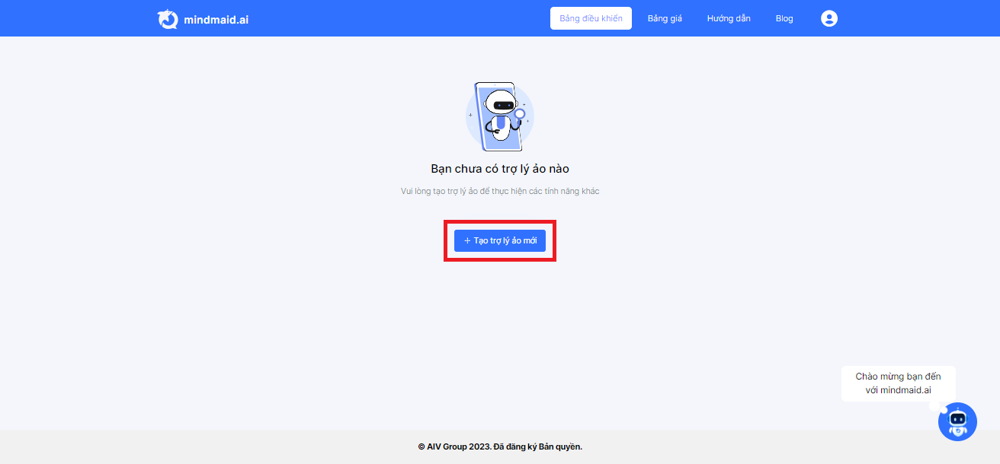

# 3.1. HDSD Mindmaid - Tạo trợ lý ảo Mindmaid mới

**Bước 1: Tại tab Bảng điều khiển, Click button Tạo Trợ lý ảo mới**

<figure><figcaption></figcaption></figure>

**Bước 2: Điền thông tin Trợ lý ảo, sao đó chọn Tạo trợ lý ảo**&#x20;

* Tên trợ lý ảo:  Tên gọi để phân biệt các trợ lý ảo
* Tiêu đề: Tên trợ lý ảo hiển thị với người dùng&#x20;
* Tiêu đề phụ: Phần chữ được hiển thị dưới tiêu đề, mở rộng hoặc bổ trợ ý nghĩa của tiêu đề
* API Key: API Key của OpenAI&#x20;
* Lệnh điều khiển: Đây là prompt dùng để thiết lập chế độ trả lời của bot", bạn nên để giá trị mặc định mà Mindmaid gợi ý

<figure><figcaption></figcaption></figure>

Như vậy bạn đã tạo thành công Trợ lý ảo mới.
