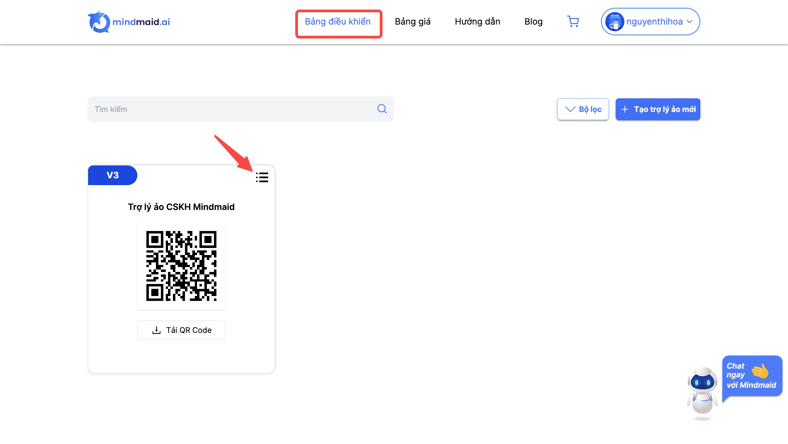
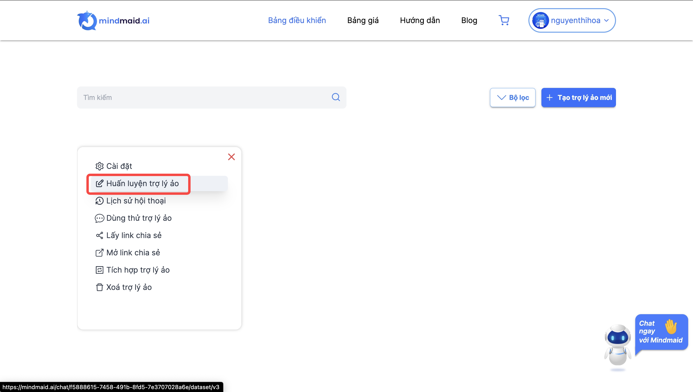
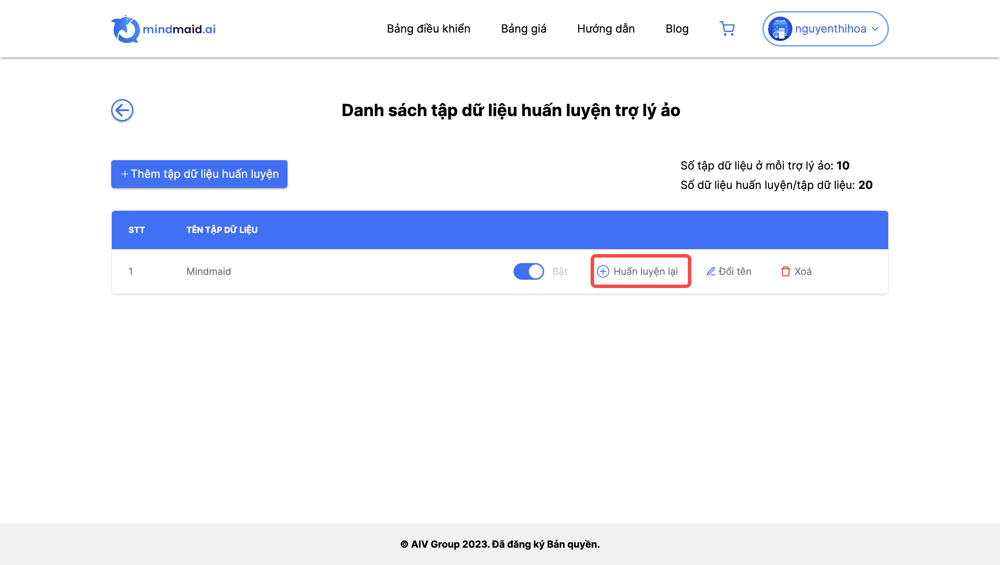
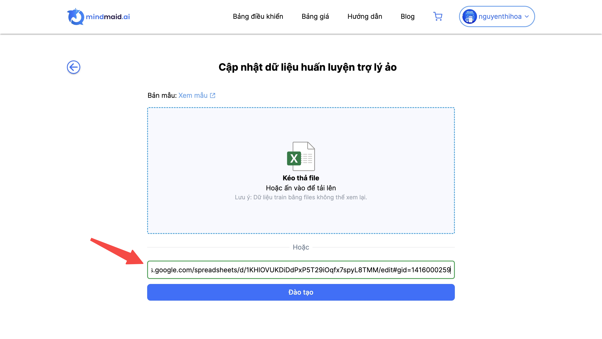
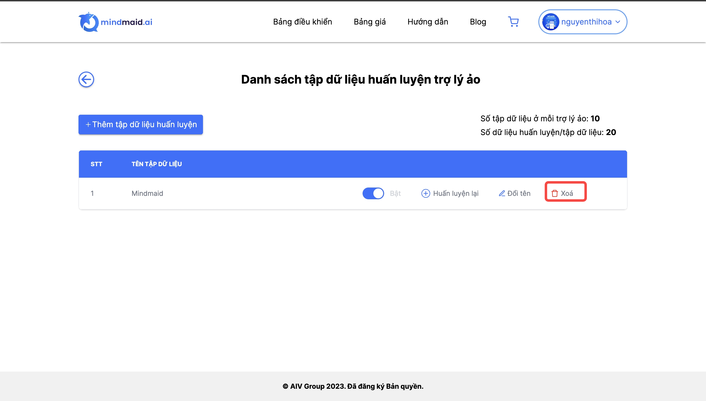
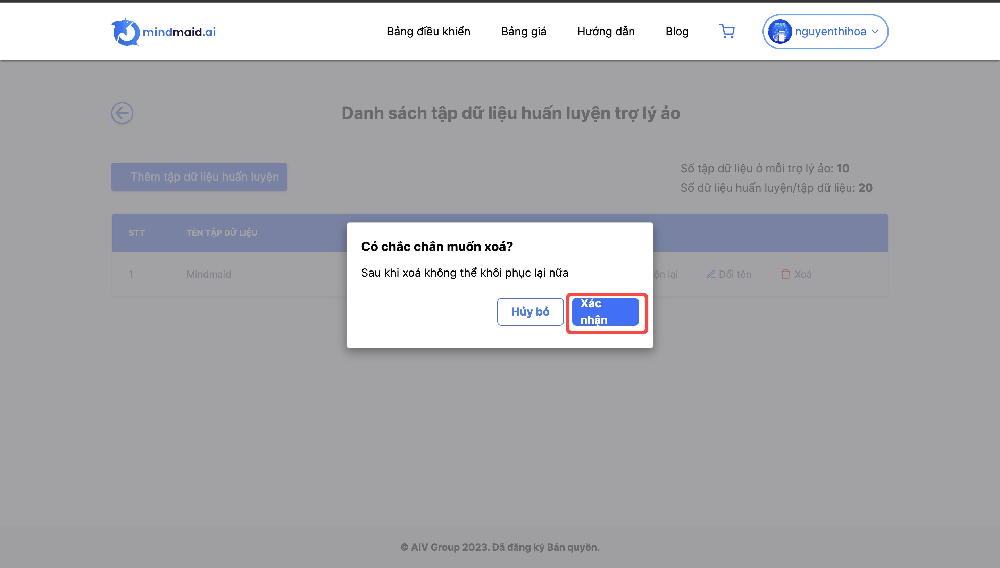
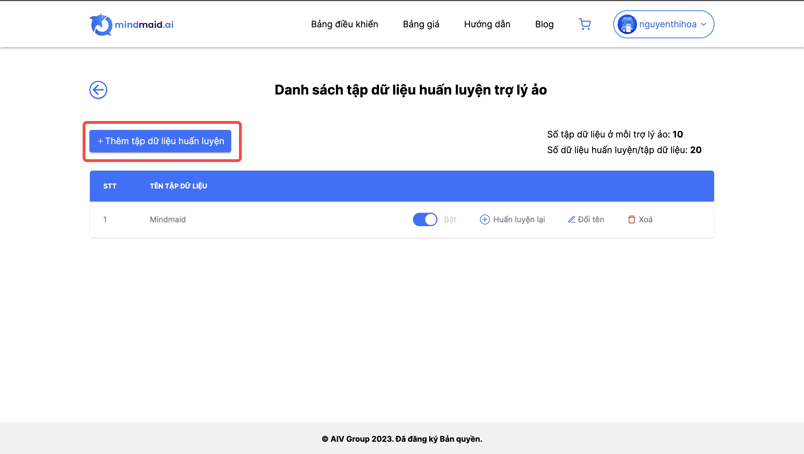
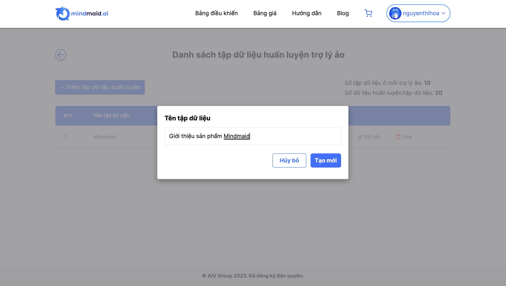

# 5. HDSD Mindmaid Huấn luyện lại Trợ lý ảo

Trong quá trình sử dụng Trợ lý ảo, người dùng có nhu cầu bổ sung hoặc chỉnh sửa dữ liệu huấn luyện cho Trợ lý ảo. Người dùng có thể huấn luyện lại Trợ lý ảo theo các bước dưới đây.

|                                                             |                                                              |
| ----------------------------------------------------------- | ------------------------------------------------------------ |
| **Bước 1: Tại tab Bảng điều khiển, ở Trợ lý ảo, click vào** |  |

**Bước 2: Click vào Huấn luyện trợ lý ảo**

**TH1: Chỉnh sửa tập dữ liệu cũ**

Tại tập dữ liệu, chọn **Huấn luyện lại**

Dán đường link sheet dữ liệu vào ô và chọn **Đào tạo**

**TH2: Xoá tập dữ liệu cũ**

Tại tập dữ liệu, chọn **Xoá**

Chọn **Xác nhận**

**TH3: Thêm tập dữ liệu mới**

Chọn **+ Thêm tập dữ liệu huấn luyện**

Đặt tên cho tập dữ liệu và chọn **Tạo mới**

Tại tập dữ liệu, chọn **Huấn luyện lại** để bổ sung dữ liệu cho tập dữ liệu này

Dán đường link sheet dữ liệu vào ô và chọn **Đào tạo**

