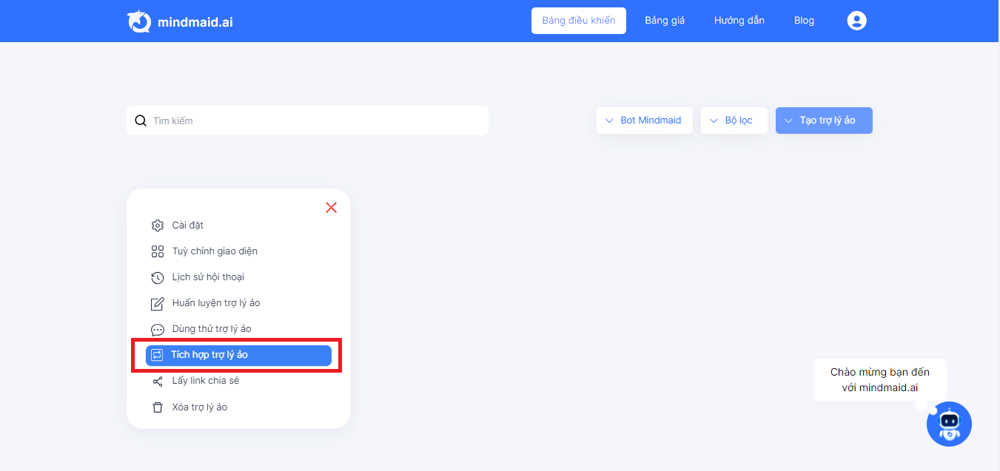

# 6. HDSD Mindmaid - Tích hợp Website

<table data-header-hidden><thead><tr><th width="479"></th><th></th></tr></thead><tbody><tr><td><strong>Bước 1: Tại tab Bảng điều khiển, ở Trợ lý ảo, click vào</strong></td><td></td></tr></tbody></table>

<figure><figcaption></figcaption></figure>

**Bước 2: Chọn Tích hợp Trợ lý ảo**

<figure><figcaption></figcaption></figure>

**Bước 3: Lấy mã nhúng**

* Chọn Website
* Bật tích hợp
* Copy mã nhúng

<figure><figcaption></figcaption></figure>

**Bước 4: Nhúng đoạn mã vào website của bạn**

Với ngôn ngữ html: thêm đoạn mã vào phần Head hoặc body của trang web

.png>)

Với ngôn ngữ reactjs: tìm file “index.html” và thêm đoạn mã vào phần Head hoặc body của trang web

.png>)
