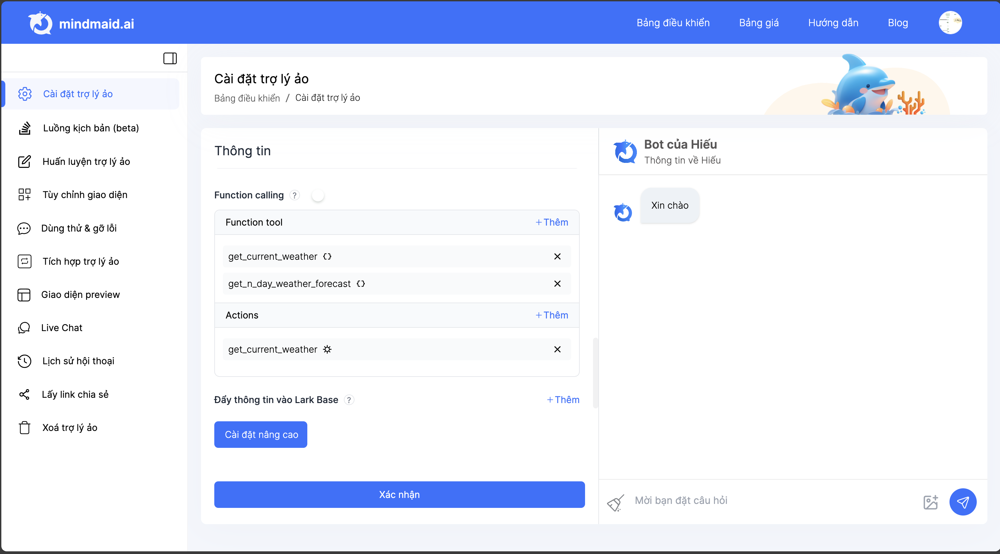

# 8. HDSD Mindmaid - Cài đặt nâng cao

<figure><figcaption></figcaption></figure>

Ngoài các cài đặt cơ bản trong quá trình tạo bot tại [3.-hdsd-mindmaid-ta-o-tro-ly-a-o-mo-i.md](../3.-hdsd-mindmaid-ta-o-tro-ly-a-o-mo-i.md "mention"), người dùng có thể cài đặt các tính năng nâng cao cho chatbot tại phần Cài đặt Trợ lý ảo.

Cài đặt nâng cao của Trợ lý ảo bao gồm:

* Phân tích hình ảnh
* Bật luồng kịch bản
* Tạo hình ảnh
* Kết nối dữ liệu internet
* Chế độ cá nhân hoá&#x20;
