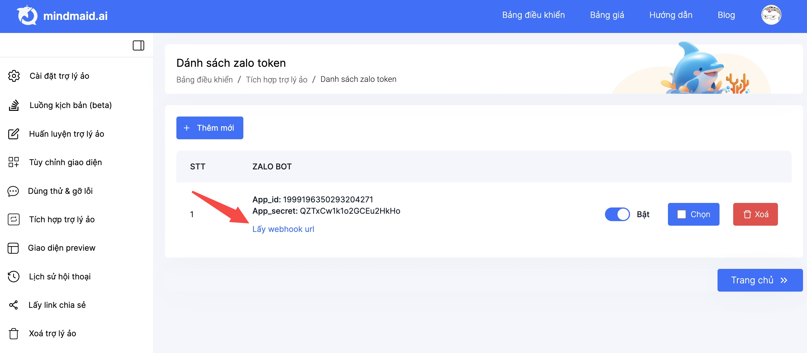

# 9. HDSD Mindmaid - Tích hợp Zalo OA

## Bước 1. Tạo app Zalo OA

Xem chi tiết hướng dẫn tại đây: [https://zalo.cloud/blog/huong-dan-tao-ung-dung-app-id-va-lien-ket-voi-zalo-oa-/kgua7vnkkvbyy88rma](https://zalo.cloud/blog/huong-dan-tao-ung-dung-app-id-va-lien-ket-voi-zalo-oa-/kgua7vnkkvbyy88rma)&#x20;

## Bước 2. Lấy App ID và App Secret của ứng dụng ZaloOA

<figure><figcaption></figcaption></figure>

## Bước 3. Truy cập vào trang bảng điều khiển của Mindmaid chọn bot cần kết nối với ZaloOA.

<figure><figcaption></figcaption></figure>

## Bước 4. Ở giao diện cài đặt chatbot, chọn "tích hợp trợ lý ảo"

<figure><figcaption></figcaption></figure>

## Bước 5. Chọn kết nối Zalo

<figure><figcaption></figcaption></figure>

## Bước 6. Ở cửa sổ hiện lên chọn danh sách Zalo Token

<figure><figcaption></figcaption></figure>

## Bước 7. Ở giao diện danh sách zalo token chọn "thêm mới"

<figure><figcaption></figcaption></figure>

## Bước 8. Ở cửa sổ hiện lên, nhập AppID và App Secret đã lấy ở bước 2.

<figure><figcaption></figcaption></figure>

## Bước 9. Chọn lấy webhook và copy đoạn mã của Mindmaid

<figure><figcaption></figcaption></figure>

## Bước 10. Cài đặt webhook của Mindmaid cho ZaloOA app

<figure><figcaption></figcaption></figure>
