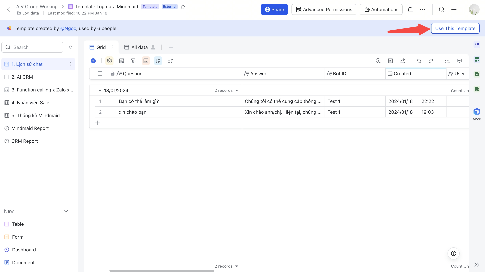

# Hướng dẫn nâng cao - Đổ dữ liệu chatbot Mindmaid vào Lark Base

## A. Tạo Lark App và cấp quyền cho Lark App


Nếu bạn đã có Lark App, vui lòng bỏ qua bước này!


| <ul><li>Truy cập Lark Developer tại: https://open.larksuite.com/</li><li>Chọn <strong>Create App</strong></li></ul>                                                                                                                                                                                                                         |                                             |
| ------------------------------------------------------------------------------------------------------------------------------------------------------------------------------------------------------------------------------------------------------------------------------------------------------------------------------------------- | ------------------------------------------------------------------------------------------------------------------- |
| <ul><li>Chọn <strong>Create Custom App</strong></li></ul>
 
                                                                                                                                                                                                                                                                        |                                         |
| <ul><li>Điền thông tin của App và chọn <strong>Create</strong></li></ul>
 
                                                                                                                                                                                                                                                         |                                             |
| <ul><li>Trong trang <strong>Permissions &#x26; Scopes, add tất cả các quyền</strong></li><li>Chọn <strong>Add in Bulk</strong></li><li>Chọn <strong>Confirm and Go to Create Version</strong></li><li>Điền thông tin version</li><li>Chọn Submit để gửi Admin duyệt</li></ul>
 <em><strong>Vui lòng xem video ở dưới</strong></em>
 |  |
| <ul><li>Sau khi Admin duyệt, bạn đã hoàn thành việc tạo Lark App</li></ul>                                                                                                                                                                                                                                                                  | 
 
                                                                                                         |
| <ul><li>Lấy App ID và Secret ID</li></ul>                                                                                                                                                                                                                                                                                                   |                                            |



## B. Tạo Base từ template

* Tạo Base mới từ template sau: [https://aivgroupworking.sg.larksuite.com/base/HFqdbTYqRaEgrMsNABJlcmklgvd?table=tblXDQwkdbEoBYu7\&view=vewPA81xUf](https://aivgroupworking.sg.larksuite.com/base/HFqdbTYqRaEgrMsNABJlcmklgvd?table=tblXDQwkdbEoBYu7\&view=vewPA81xUf)&#x20;

<figure><figcaption></figcaption></figure>

* Phân quyền **People in the organization can edit**

<figure><figcaption></figcaption></figure>

* Lấy ID của bảng Lịch sử chat & Function Calling

<figure><figcaption></figcaption></figure>

<figure><figcaption></figcaption></figure>

## C. Cài đặt trong Mindmaid&#x20;

* Bước 1: Vào phần Cài đặt

<figure><figcaption></figcaption></figure>

*   Bước 2: Nhập các thông tin&#x20;

    * Lark App ID
    * Lark App Secret
    * Base ID
    * Lịch sử chat Table ID
    * Function Calling Table ID&#x20;

    <figure><figcaption></figcaption></figure>


**Liên hệ với chúng tôi**

* 0961160917 (Zalo)
* Facebook: [https://www.facebook.com/hoaingocduongthu](https://www.facebook.com/hoaingocduongthu)
* Lark: [Ngọc ](https://www.larksuite.com/invitation/page/add\_contact/?token=f61t41d4-bcb8-41b3-b29e-398857h221l8\&unique\_id=mfjNlUNTxVNzsH8b6BmGFw==)

