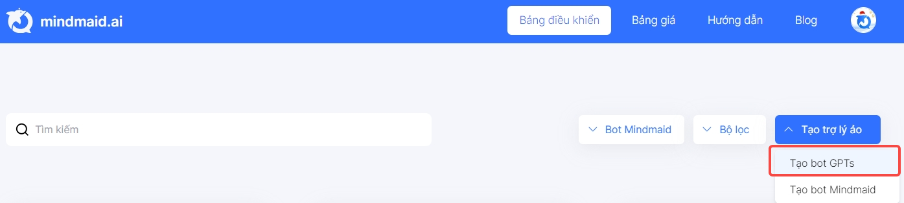

# Hướng dẫn tính năng function calling

1\. Mô tả tính năng

Tính năng function calling cho phép người dùng có thể kết nối với dữ liệu từ bên ngoài hoặc lấy thông tin người dùng sử dụng chatbot

## 2. Cách sử dụng

### 1. Truy cập https://mindmaid.ai và đăng nhập tài khoản của bạn

<figure><figcaption></figcaption></figure>

### 2. Chọn vào bot muốn sử dụng

<figure><figcaption></figcaption></figure>

### 3. Chọn vào tính năng "Function calling"

**Function tool**

* Trong menu cài đặt "Function tool" gọi tắt là FT có thể tùy chọn tạo một FT hoặc nhiều FT để thực hiện các tác vụ đặc biệt ví dụ như: Lấy số điện thoại, email người dùng nhập vào, ...
* Một FT có thể viết như sau:

```
{
  "name": "mindmaid_phone_email", # Tên của Function
  "description": "Get name or phone number or email address of the user", # Mô tả Function
  "parameters": {
    "type": "object", # Loại parameter nên để mặc định object
    "required": [ # Yêu cầu các trường nào bắt buộc phải có dữ liệu ở đây là location
      "location"
    ],
    "properties": { # Chi tiết các trường thông tin cần lấy
      "name": { # Tên (Cần viết tiếng anh không dấu và cách nhau bằng _)
        "type": "string", # Loại dữ liệu của trường ở đây là string
        "description": "the name of the user" # Mô tả trường dữ liệu này là gì (càng chi tiết càng tốt và nên có ví dụ)
      },
      "email": { 
        "type": "string",
        "description": "the email address of the user"
      },
      "phone": {
        "type": "string",
        "description": "The phone number of Vietnamese"
      }
    }
  }
}
```

* Lưu ý name của function tool không nên viết trùng nhau khi function calling cho một bot

**Actions**

* Action là một tính năng giúp chatbot có thể dựa vào Function tool để từ đó tương tác với dữ liệu bên ngoài qua API
* Để Action hoạt động bắt buộc bạn phải có Function tool trước đó
*   Nhập các thông tin cần thiết của Action:

    * Tên hàm: Ở đây cần chọn tên hàm là một trong các function calling đã tạo trước đó
    * Địa chỉ API: Là địa chỉ API bên ngoài của bạn mà gpts sẽ sử dụng
    * Phương thức call API: Là phương thức gọi API của bạn ví dụ: GET hoặc POST
    * API Key: Là Key của API nếu có (có thể để trống nếu API không yêu cầu)
    * Loại xác thực: Là loại xác thực API của bạn ở đây hỗ trợ 2 kiểu là Bearer/API Key nếu có (có thể để trống nếu API không yêu cầu)
    * Template trả lời: Là mẫu hướng dẫn gpts trả lời mặc định nếu không muốn sử dụng dữ liệu đầu ra của API làm context trả lời

    <figure><figcaption></figcaption></figure>


Sau khi điền xong, bấm **Xác nhận** để lưu lại cài đặt của bot về Function calling

### Lúc này bạn chat với bot sẽ dựa vào Function tool và Actions tương ứng để lấy dữ liệu từ API của Action để trả lời


\


> Lưu ý:
>
> * Nếu action không hoạt động thì mặc định dữ liệu đầu ra của action sẽ là template trả về nếu có cài đặt hoặc nếu không có template trả lời thì sẽ mặc định là dữ liệu trống.
